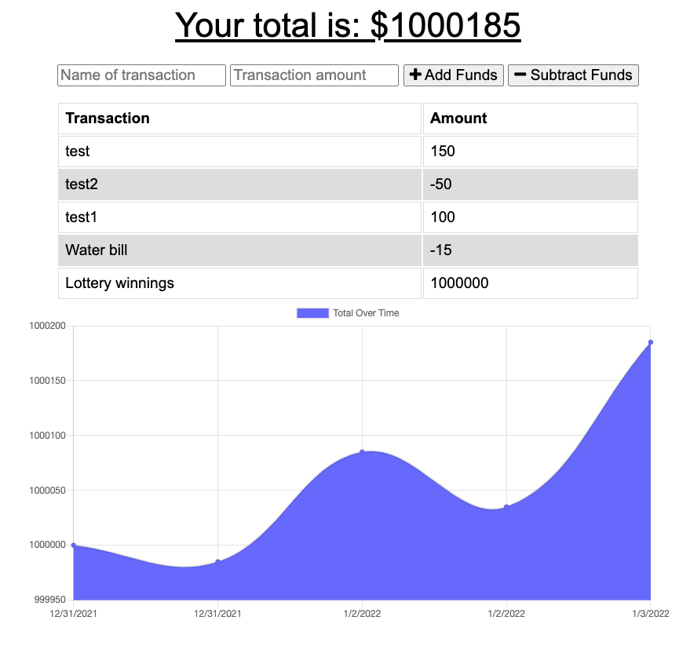

# Budget Graph
  
  ## Description
  This PWA (Progressive Web Application) gives users a way to keep track of their cash flow.

  
  
  ## Table of Contents
  * [Installation](#installation)
  * [Usage](#usage)
  * [License](#license)
  * [Contributing](#contributing)
  * [Tests](#tests)
  * [GitHub](#github)

  ## Installation
  Clone repository from GitHub and install dependencies (express, logger, mongoose, and compression). To start the server run `npm start`. Otherwise, use the deployed version: https://safe-escarpment-97040.herokuapp.com/

  ## Contributing
  This project follows the Contributor Covenant.  
  

  ## Questions
  Reach out via email or GitHub.  
  cassie.s.simpson@gmail.com  
  [cassie-s](https://github.com/cassie-s/)

  

